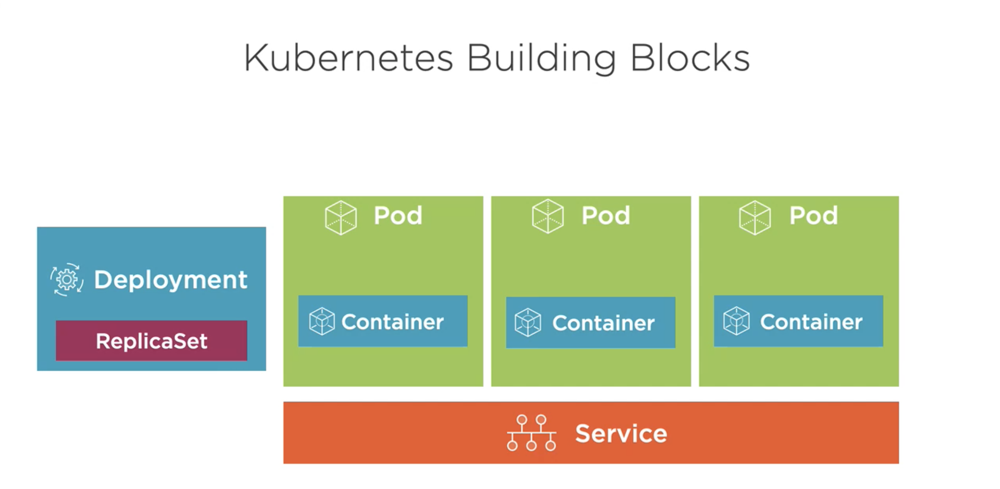

Kubernetes (K8s)
===

automating deployment, scaling and management of containerized applications

- Service Discovery / Load Balancing
- Storage Orchestration
- Automate Rollouts/Rollbacks (Zero Downtime)
- Self-healing
- Secret and Configuration Management
- Horizontal Scaling


Master -> Nodes -> Pods -> Containers

Kubernetes Building Blocks


Install
===

[Minikube](https://github.com/kubernetes/minikube)
[Docker Desktop](https://www.docker.com/products/docker-desktop)
[kind](https://kind.sigs.k8s.io)
[kubeadm](https:/kubernetes.io/docs/reference/setup-tools/kubeadm/kubeadm)


Commands
===
```bash
kubectl version       # Check Kubernetes version

kubectl cluster-info  # View cluster information

kubectl get all       # Retrieve information about Kubernetes, Pods, Deployments, Services, etc.

kubectl port-forward [pod] [ports]  # Forward a port to allow external access

kubectl expose ...                  # Expose a port for a Deployment/Pod

kubectl create [resource]           # Create a resource

kubectl apply [resource]            # Create or modify a resource

kubectl run [container-name] --image=[image-name]      # Create a Deployment for a Pod
```

Web UI dashboard
===

https://kubernetes.io/docs/tasks/access-application-cluster/web-ui-dashboard

```bash
kubectl describe secret -n kube-system  # Get tokens (kubernetes.io/service-account-token)

kubectl proxy
```