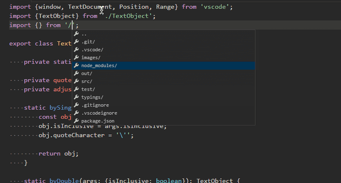
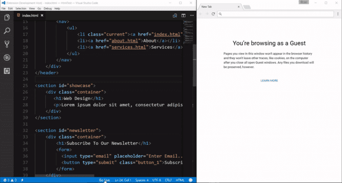

Useful Extensions
===

Common
---

### 1. Path Intellisence

    Auto-completing filenames

### 2. Visual Studio Intellicode

    Smart code completion suggestions and has pre-built support for a wide array of programming languages.

### 3. Settings Sync

    Manage your dev configs conveniently and hassle-free across all of your workstations

### 4. Prettier

### 5. Bracket Pair Colorizer

### 6. Code Spell Checker

### 7. REST Client

Postman alternative

Web Development
---

### 1. Debugger for Chrome

### 2. Live Server

    Setting up a development server
 

 
### 3. Vetur (for Vue.js)

### 4. Quokka (for javascript)

### 5. Open in Browser

`Alt + B` key combination opens the current file in the default browser 
`Shift + Alt + B` opens in specified browser

Markdown
---

### 1. Markdown All in One