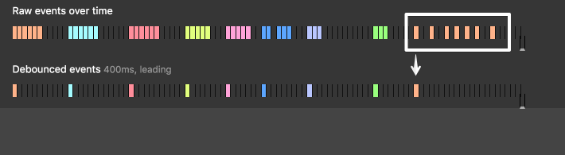

Debounce
===

“Group” multiple sequential calls in a single one.


- Trailing debounce

    </img>

- Leading debounce

    </img>

Implementation
---
1. Underscore.js https://underscorejs.org/
  
      `_.debounce`

2. Write your own
    ```js
    function debounce(func, delay) {  // Trailing debounce
      var timer = null;    
      return function () { // Return function as a closure, storing context and args
        var context = this;
        var args = arguments;
        clearTimeout(timer);  // Reset timer whenever there is another function call within `delay` seconds, 
        timer = setTimeout(function () { // Apply function if there is no function call in `delay` seconds after the first call, 
          func.apply(context, args)
        }, delay);
      }
    }
    ```

Use case example
---
1. OnChange ajax [Example](example/debounce.html)

[Throttle](Throttle.md) | [Back](../index.md)