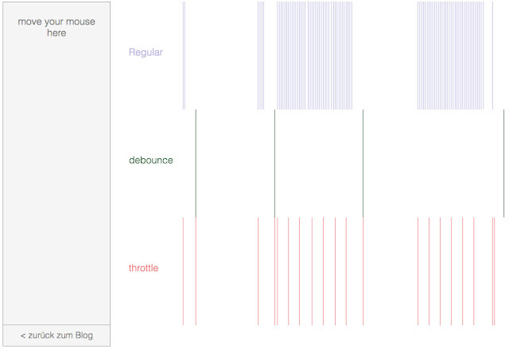

Debounce and Throttle
===

Debounce and throttle are two similar (but different!) techniques to control how many times we allow a function to be executed over time.

- [Debounce](_/Debounce.md)
- [Throttle](_/throttle.md)